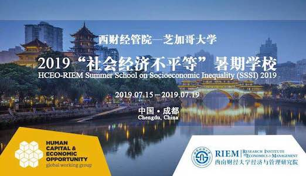

##  About the Program

The Human Capital and Economic Opportunity Global Working Group (HCEO) at the University of Chicago and the Research Insititue of Economics and Management (RIEM) at Southwestern Unviersity of Finance and Economics (SWUFE) will co-host the HCEO's famous Summer School on Socioeconomic Inequality (SSSI) in Chengdu, China, July 15-19, 2019.

HCEO-RIEM SSSI Chengdu will provide a state-of-the-art overview on the study of inequality and human flourishing. Participants will learn about the integration between psychological and sociological insights into the foundations of human behavior and conventional economic models. Through rigorous lectures students will be trained on various tools needed to study the issue of inequality.

During these intense programs, students attend lectures, engage in discussions with leading faculty from around the world, present their own research, and interact with peers from institutions across the globe. 

To date, SSSI has been held in the U.S. (Chicago, 2012, 2013, 2015, 2016, 2017, 2018), UK (Cambridge, 2014), Russia (Moscow, 2017), Germany (Bonn, 2016, 2018), China (Beijing, 2013, 2014, 2015, and Guangzhou, 2016, 2017). 

For more information please visit HCEO's offcial website <a href="https://hceconomics.uchicago.edu/events/summer-school-socioeconomic-inequality-chengdu-sssi-2019-chengdu" target="_blank"> Summer School on Socioeconomic Inequality, Chengdu (SSSI 2019 Chengdu)</a>.

##  Tentative Schedule

| Day 1: 07/15, Monday |              |                    |        | 
| --- | --- | --- | --- | 
| 09:00 AM -- 10:30 AM | Lecture 1:       | Steven Durlauf     | University of Chicago | 
| 10:30 AM -- 11:00 AM | Break            |                    |                       | 
| 11:00 AM -- 12:30 PM | Lecture 2:       | Steven Durlauf     | University of Chicago | 
| 12:30 PM -- 01:30 PM | Lunch            |                    |                       | 
| 01:30 PM -- 03:00 PM | Lecture 3:       | Lawrence Blume     | Cornell University / IHS Vienna | 
| 03:00 PM -- 03:30 PM | Break            |                    |                                 | 
| 03:30 PM -- 05:00 PM | Lecture 4:       | Lawrence Blume     | Cornell University / IHS Vienna | 
| 05:30 PM -- 07:30 PM | Welcome Dinner for All Participants |     |   | 
| Day 2: 07/16, Tuesday |              |                   |    | 
| --- | --- | --- | --- |
| 09:00 AM -- 10:30 AM | Lecture 5:       | Fali Huang     | Singapore Management University | 
| 10:30 AM -- 11:00 AM | Break            |                |   | 
| 11:00 AM -- 12:30 PM | Lecture 6:       | Fali Huang     | Singapore Management University  | 
| 12:30 PM -- 01:30 PM | Lunch            |             |   | 
| 01:30 PM -- 03:00 PM | Lecture 7:       | Chao Fu     | University of Wisconsin-Madison  | 
| 03:00 PM -- 03:30 PM | Break            |             |   | 
| 03:30 PM -- 04:15 PM | Poster Session 1  |       |   | 
| 04:15 PM -- 05:00 PM | Poster Session 2  |       |   | 
| 05:00 PM -- 06:30 PM | Office Hours  |       |   | 
| Day 3: 07/17, Wednesday |              |                   |      | 
| --- | --- | --- | --- |
| 09:00 AM -- 10:30 AM | Lecture 8:       | Chao Fu     | University of Wisconsin-Madison  | 
| 10:30 AM -- 11:00 AM | Break            |             |   | 
| 11:00 AM -- 12:30 PM | Lecture 9:       | Yi Lu     | Tsinghua University  | 
| 12:30 PM -- 01:30 PM | Lunch            |             |   | 
| 01:30 PM -- 03:00 PM | Lecture 10:      | Yi Lu     | Tsinghua University  | 
| 03:00 PM -- 03:30 PM | Break            |             |   | 
| 03:30 PM -- 06:39 PM | Group Outing  |       |   | 
| Day 4: 07/18, Thursday |              |                    |  | 
| --- | --- | --- | --- |
| 09:00 AM -- 10:30 AM | Lecture 11:       | Flavio Cunha     | Rice University  | 
| 10:30 AM -- 11:00 AM | Break            |                    |  | 
| 11:00 AM -- 12:30 PM | Lecture 12:       | Flavio Cunha     | Rice University | 
| 12:30 PM -- 01:30 PM | Lunch            |                    |
| 01:30 PM -- 03:00 PM | Lecture 13:       | Mark Rosenzweig     | Yale University | 
| 03:00 PM -- 03:30 PM | Break            |                    | | 
| 03:30 PM -- 05:00 PM | Lecture 14:       | Mark Rosenzweig     | Yale University | 
| 05:15 PM -- 06:00 PM | Office Hours |     |  | 
| Day 5: 07/19, Thursday |              |                    |  | 
| --- | --- | --- | --- |
| 09:00 AM -- 10:30 AM | Lecture 11:       | Junsen Zhang    | Chinese University of Hong Kong | 
| 10:30 AM -- 11:00 AM | Break            |                    |  | 
| 11:00 AM -- 12:30 PM | Lecture 12:       | Junsen Zhang    | Chinese University of Hong Kong  | 
| 12:30 PM -- 01:30 PM | Lunch            |                    |  | 
| 01:30 PM -- 03:00 PM | Office Hours |     |    | 
  
